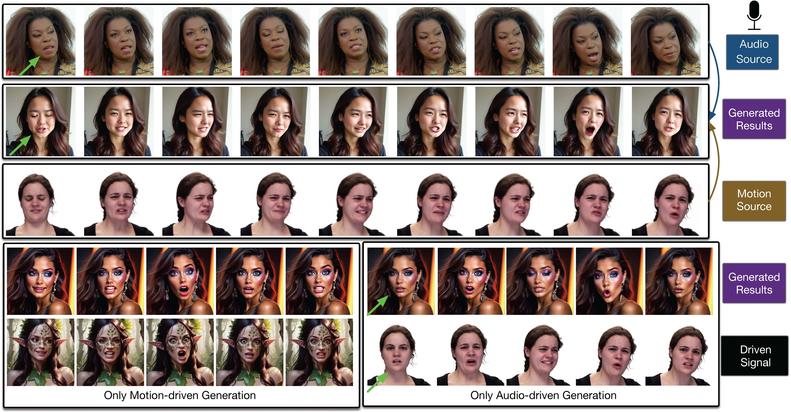
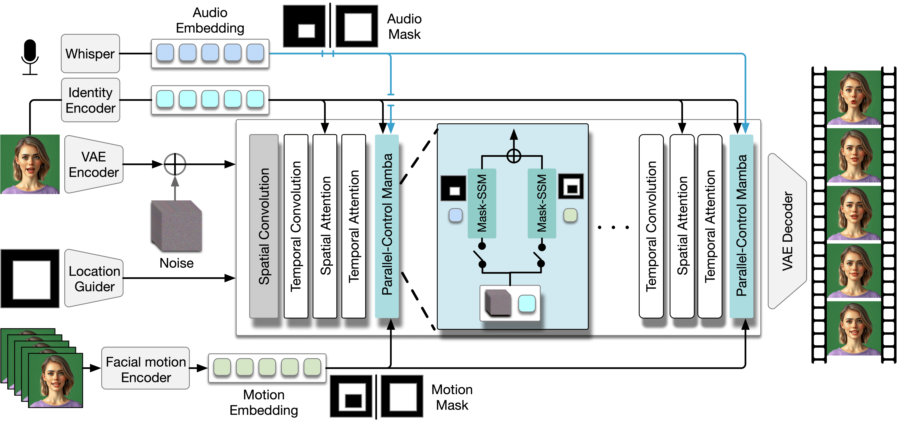

## :book: Audio-visual Controlled Video Diffusion with Masked Selective State Spaces Modeling for Natural Talking Head Generation

> [[Paper](https://harlanhong.github.io)] &emsp; [[Project Page](https://harlanhong.github.io/publications/actalker/index.html)]  &emsp; [[HuggingFace](https://huggingface.co/papers/2504.02542)] 
<!-- > [Fa-Ting Hong](https://harlanhong.github.io), [Longhao Zhang](https://dblp.org/pid/236/7382.html), [Li Shen](https://scholar.google.co.uk/citations?user=ABbCaxsAAAAJ&hl=en), [Dan Xu](https://www.danxurgb.net)   -->
<!-- > The Hong Kong University of Science and Technology, Alibaba Cloud -->
> [Fa-Ting Hong](https://harlanhong.github.io)1,2, Zunnan Xu2,3, Zixiang Zhou2, Jun Zhou2, Xiu Li3, Qin Lin2, Qinglin Lu2, [Dan Xu](https://www.danxurgb.net)1  
> 1The Hong Kong University of Science and Technology 
> 2Tencent 
> 3Tsinghua University

:triangular_flag_on_post: **Updates**  

&#9745; arXiv paper is released [here](https://arxiv.org/pdf/2410.01647) !

## Framework 

## TL;DR:
We propose ACTalker, an end-to-end video diffusion framework for talking head synthesis that supports both single and multi-signal control (e.g., audio, pose, expression). ACTalker uses a parallel mamba-based architecture with a gating mechanism to assign different control signals to specific facial regions, ensuring fine-grained and conflict-free generation. A mask-drop strategy further enhances regional independence and control stability. Experiments show that ACTalker produces natural, synchronized talking head videos under various control combinations.

## Expression Driven Samples
https://github.com/user-attachments/assets/fc46c7cd-d1b4-44a6-8649-2ef973107637

## Audio Dirven Samples
https://github.com/user-attachments/assets/8f9e18a0-6fff-4a31-bbf4-c21702d4da38

## Audio-Visual Driven Samples
https://github.com/user-attachments/assets/3d8af4ef-edc7-4971-87b6-7a9c77ee0cb2

https://github.com/user-attachments/assets/2d12defd-de3d-4a33-8178-b5af30d7f0c2

### :e-mail: Contact

If you have any question or collaboration need (research purpose or commercial purpose), please email `fhongac@connect.ust.hk`.
